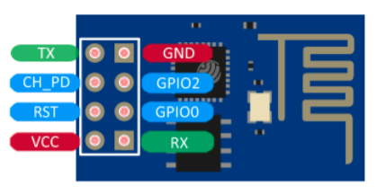
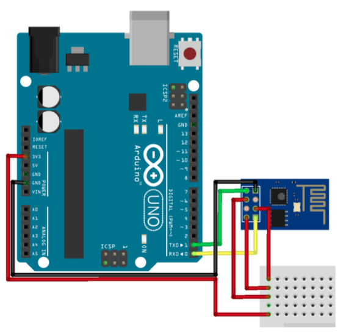
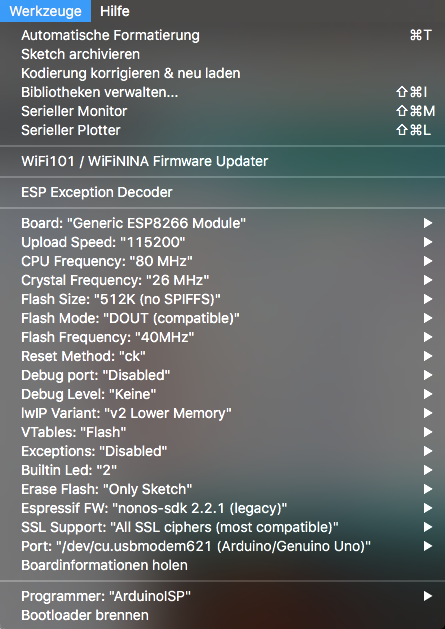

# ESP8266
the missing manual

## Flash ESP via an Arduino Uno

basically follow the instructions as stated in the [ESP8266 Manual](assets/SBC-ESP8266-Anleitung.pdf).

Breakout Pins:

Connections:

### hints that are NOT stated in the manual

- In order to talk directly to the ESP, the Arduino Chip has to be bypassed - there are two possible ways:
  - Arduino has to be programmed with an Empty sketch
  - connect Reset Pin with GND

- for program mode the GPIO-0 has to be connected to GND
- for some reason the ESP often does not respond during the connecting process. but it connects if it is being reset shortly before or at the beginning of the connection process
  - this is done by shortly connecting the RST pin to GND
  - a push butten closing the circuit makes the process more convenient

- connecting TX with TX and RX with RX is correct (!)  
  (because the TX0 is connected to the TX from the Arduino Chip. but if the Chip is bypassed, the TX0 is internally shortcut to the RX of the USB-Serialconnector)

- using TX and RX without voltage divider works apparently  
  (the ESP works with 3.3V but the Arduino sends its signals with a 5V level - nevertheless it works directly)

- same applies for the GPIO-2 as input, if there is a digital 5V sensor connected

- if you want to use the GPIO-2 (for receiving digital data form a sensor for instance), it has to be connected to VCC during start.

- the buildin LED is connected to 1. it turns on when sending LOW and turns off when sending HIGH  
  - digitalWrite(1, LOW); // turns LED on  
  - (if the blink sketch doesnt seem to work, it is possibly because the static variable LED_BUILTIN addresses the wrong connection)
  
- in the Arduino IDE the basic upload settings should work:

