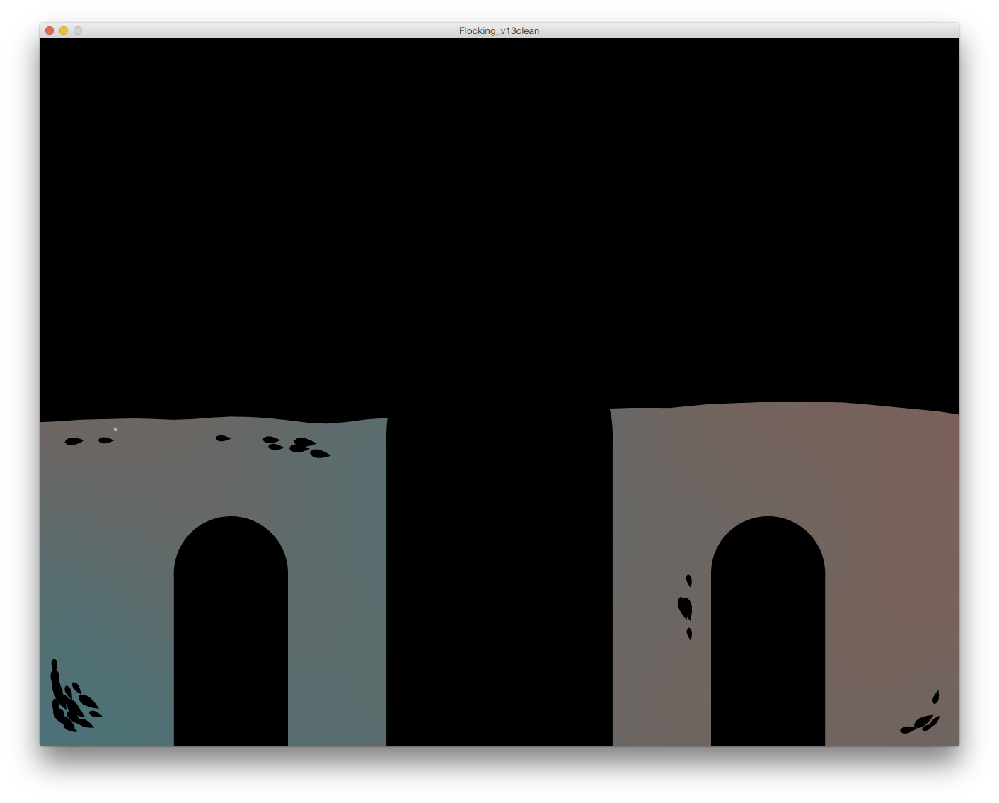
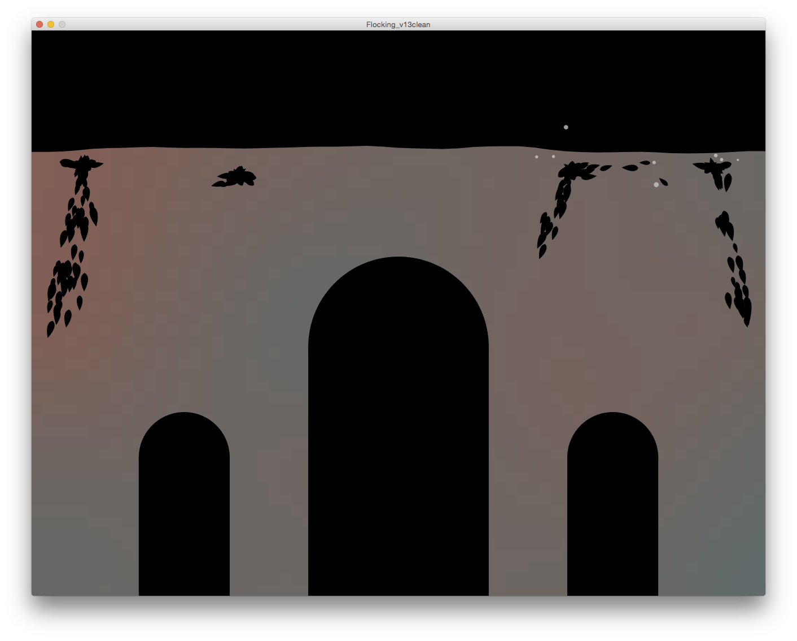
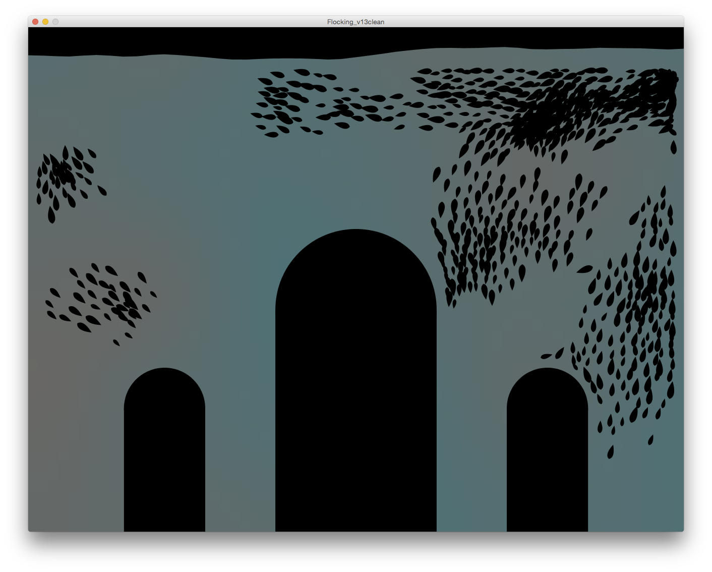
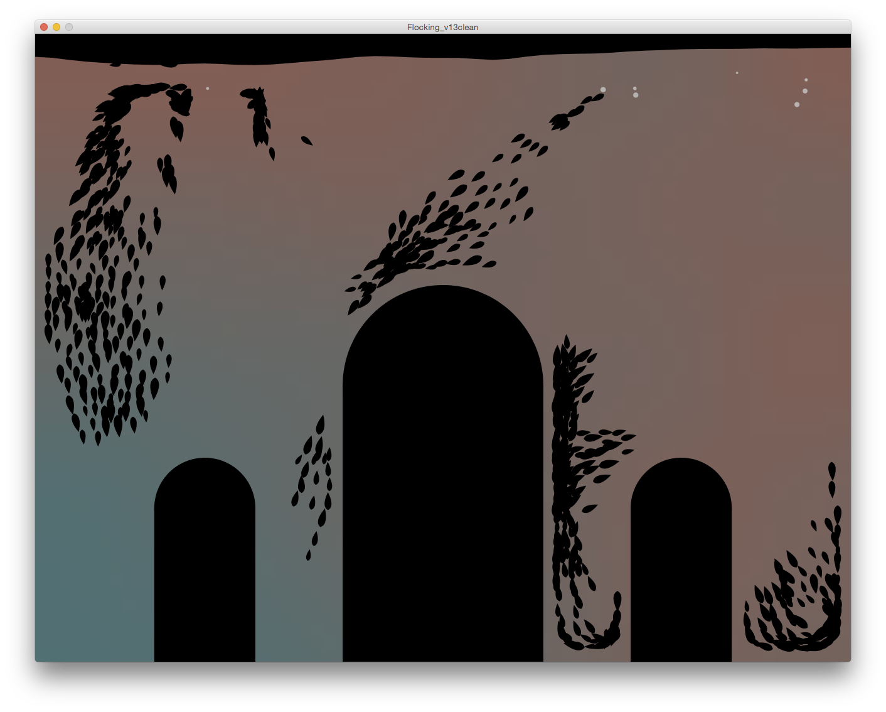

# Schwarmpräsenz
Simon Stimberg 2019  
Interactive Projection Mapping
(Swarm Behaviour Simulation - Sensors)

@Lichtspektakel Potsdam, 2019:  
https://vimeo.com/387821884

## Artistic Intention
The project is intended as an interactive projection on the Brandenburger Tor in Potsdam.  
The facade of the building is being virtually filled with water. Small creatures are living on it, moving in swarms. Once a visitor of the installation passes one of the gateways of the building, a new bunch of creatures is being spawned, translating the visitors' presence to the facade. Here it unites with the "souls" of other visitors to a continuously growing swarm entity, synchronizing its movements and behavior.  
As the swarm grows, the water level rises until it fills up the whole Brandenburger Tor. As a gimmick the creatures can also being fed interactively by pushing a button or passing another gateway.  

## Programming Details
The developed code is written in Processing and based on the teachings and tutorials from The Nature of Code by Daniel Shiffman, mainly on chapter #6 Autonomous Agents. With the help of it I integrated his implementation of Craig Reynolds' steering behaviors for Flocking (cohesion, alignment, separation), wandering and seeking a target.  
On this basis I developed a stay-inside-the-walls behavior, so that the boids move in the given architecture of the building. Futhermore I added a search-for-food behavior, for which I created a food class with food particles being thrown into the water. The implementation of the simulated physical forces are derived from the Nature of Codes' example for liquid resistance.  
Beyond that I implemented a (back)ground with a continuously changing color gradient driven by Perlin Noise, resembling the appearance of being under water plus a Wave class, that mimics a water surface.

### Interaction
In the Processing sketch following interactions are implemented:  
- new boids can be added by pressing '1' or '2',  
  spawning them at either the left or the right gateway.  
- food can be dropped at a random position by pressing the Space Bar.

### Screenshots

at an early stage:

the water level rises and food is being dropped:

as the swarm grows:

